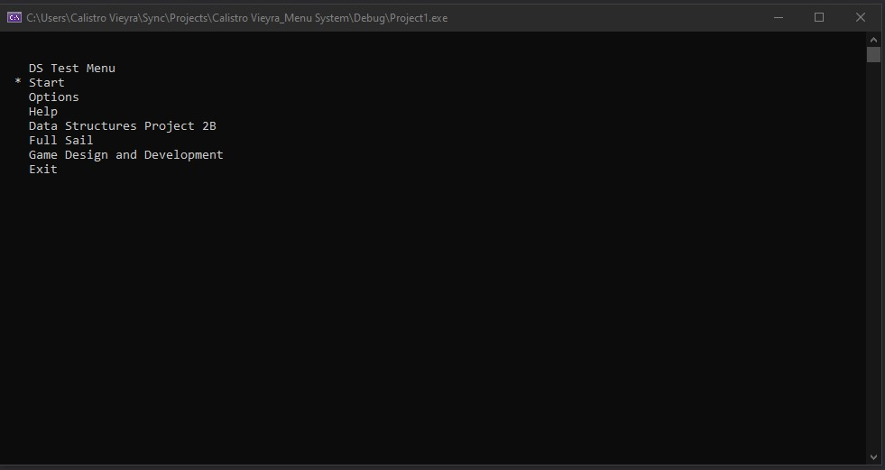

# Menu_System

This menu system here demonstrates navigating through a set of dynamically read menu files. It incorporates some implementation of key concepts in data structuring such as single linked list and a custom coded dynamic sizing array, similar to our famous standard list container.
